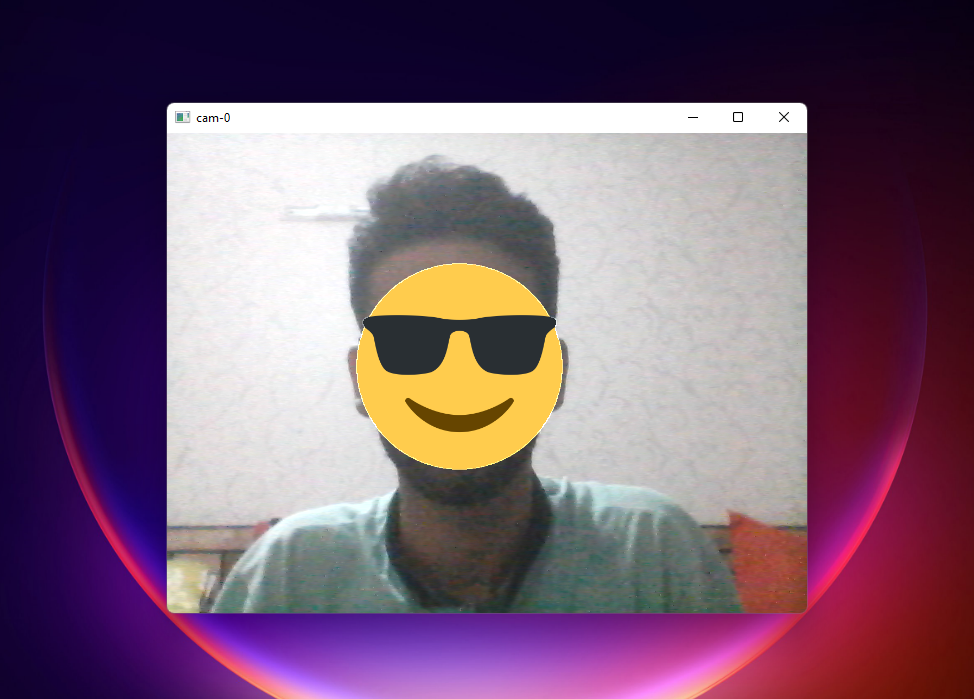
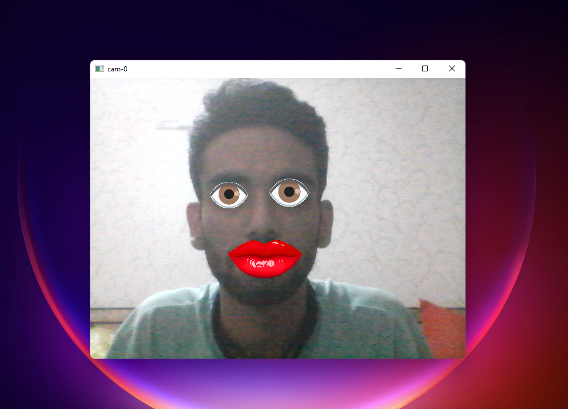
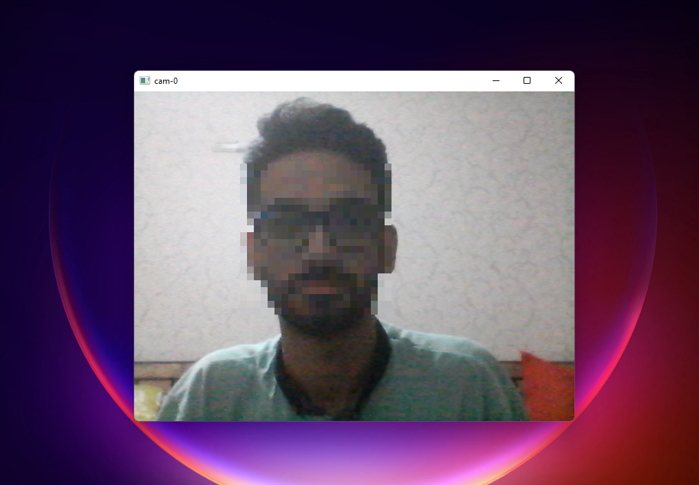
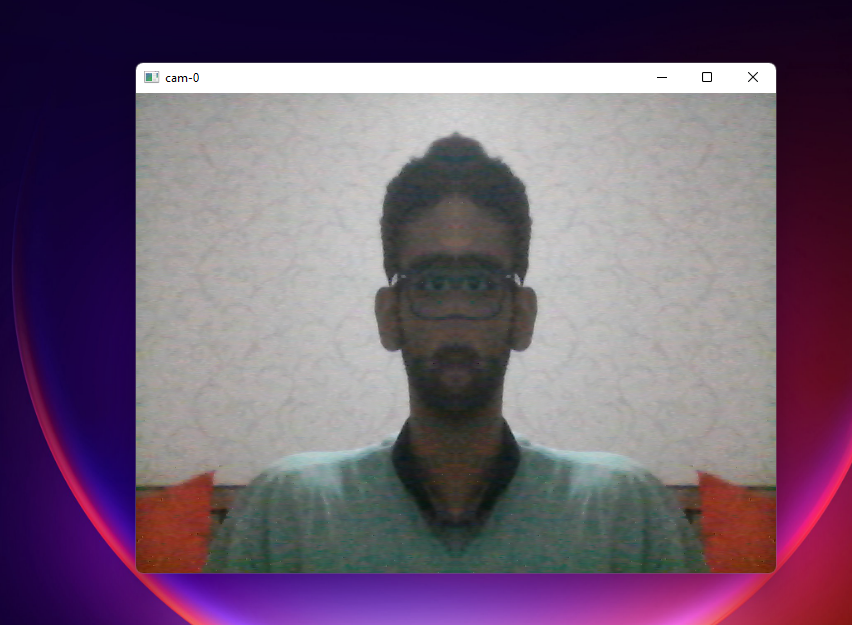

## Face Detection
- Real-time camera that can put stickers on face.
- written in **Python** using **opencv** and **numpy** (and win10toast library for notifications).
- features:
  - put sticker on face.
  - put stickers on lips and eyes.
  - censored face.
  - flip horizontal effect.
- face recognition camera using haarcascade-frontal-face algorithm.
- smile recognition camera using haarcascade-smile algorithm.
- recognition camera using haarcascade-eye algorithm.
- emoji:
  > 
- lips and eyes:
  > 
- censored face:
  > 
- flip horizontal effect:
  > 

